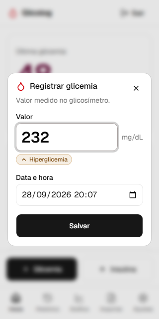
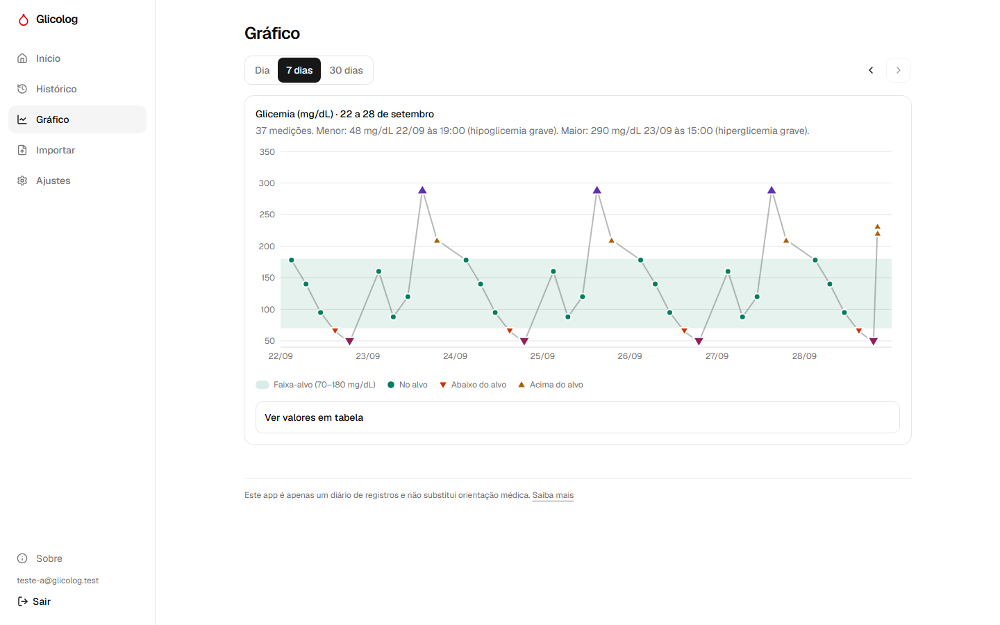

# Glicolog

Diário web de glicemia e insulina para pessoas com diabetes tipo 1. Funciona em computadores e celulares, de telas de 320px a monitores largos.

> ⚠️ Projeto de estudo/portfólio. Este app é apenas um diário de registros e **não substitui orientação médica**. Ele não sugere nem calcula doses de insulina.

Definição completa do projeto: [PROJETO.md](PROJETO.md).

<p>
  
  
</p>

## Funcionalidades

- **Conta:** cadastro com confirmação por e-mail, login, recuperação de senha e exclusão da conta com todos os dados.
- **Registro rápido:** glicemia (mg/dL) e insulina (basal ou bolus) em poucos toques, com a classificação exibida ao digitar e confirmação para doses acima de 100 U.
- **Tela inicial:** última glicemia em destaque, mini gráfico das últimas 24 h e registros do dia.
- **Histórico:** registros agrupados por dia, com edição e exclusão.
- **Gráfico:** 1, 7 ou 30 dias, navegação entre períodos, faixa-alvo sombreada, dica ao tocar e tabela de valores.
- **Ajustes:** limites das faixas personalizáveis (padrão 54/70/180/250 mg/dL).
- **Importação de CSV:** pré-visualização com linhas novas, já existentes e com erro (e o motivo); importar o mesmo arquivo duas vezes não duplica nada.

## Qualidade

- **Acessibilidade:** zero violações WCAG 2.2 AA (axe) em todas as páginas e diálogos; faixas indicadas por cor **+ ícone + texto**; paleta validada para daltonismo; navegação completa por teclado.
- **Privacidade (LGPD):** Row Level Security no Postgres — cada conta só enxerga os próprios dados, verificado por teste automatizado com duas contas.
- **Testes:** ~100 testes unitários (regras de domínio, datas no fuso de Brasília, CSV) e ~85 testes de ponta a ponta em 3 larguras de tela.

## Tecnologias

Next.js 16 · TypeScript · Tailwind CSS · shadcn/ui · Supabase (Postgres + Auth + Row Level Security) · Recharts · Zod · PapaParse · Vitest · Playwright

## Rodando localmente

Requisitos: Node.js 24+ e um projeto no [Supabase](https://supabase.com).

```bash
npm install
cp .env.example .env.local   # preencha com a URL e a publishable key do seu projeto
npx supabase login
npx supabase link --project-ref <id-do-projeto>
npx supabase db push         # cria as tabelas
npm run dev                  # http://localhost:3000
```

## Scripts

| Comando | O que faz |
|---|---|
| `npm run dev` | Servidor de desenvolvimento |
| `npm run build` | Build de produção |
| `npm run lint` | ESLint |
| `npm run typecheck` | Checagem de tipos |
| `npm test` | Testes unitários (Vitest) |
| `npm run test:e2e` | Testes de ponta a ponta (Playwright) — precisa de usuários de teste em `.env.test.local` |
| `npm run db:types` | Regenera os tipos TypeScript a partir do banco |

## Estrutura

```
src/
  app/(auth)/       telas de entrar, cadastro e senha
  app/(app)/        área logada: início, histórico, gráfico, importar, ajustes, sobre
  lib/dominio/      regras puras e testadas: faixas, validação, datas, períodos, CSV
  lib/dados/        consultas ao banco
  components/       interface (registro, gráfico, navegação, shadcn/ui)
supabase/migrations/  estrutura do banco, RLS e funções
e2e/                  testes Playwright
```
